# Training Content Systems Design

---

## Table of Contents

1. [Single Source of Truth Architecture](#1-single-source-of-truth-architecture)
2. [Content Flow](#2-content-flow)
3. [AI-Augmented Maintenance Workflows](#3-ai-augmented-maintenance-workflows)
4. [Quality Control System](#4-quality-control-system)
5. [Modular Content Architecture](#5-modular-content-architecture)
6. [Metrics and Health Indicators](#6-metrics-and-health-indicators)
7. [Implementation Phases](#7-implementation-phases)
8. [Appendix: Quick Reference](#appendix-quick-reference)

---

## 1. Single Source of Truth Architecture

### How Content Is Stored

All master content lives in a single Google Drive folder with restricted edit access. The folder contains one canonical facilitator guide, the exercise files, and the feedback templates. Trainers access a read-only published link — they never receive an editable copy.

```
training-content/
├── facilitator-guide-v1.2.docx           ← master (edit access: team only)
├── facilitator-guide-v1.2-PUBLISHED.pdf  ← trainer access copy (stable URL)
├── exercises/
│   ├── exercise1.py
│   └── exercise2.py (section of exercise1.py)
├── audience-variants/
│   ├── core-concepts-beginners.md
│   └── core-concepts-advanced.md
├── feedback/
│   ├── feedback.csv
│   └── feedback_meta.json
└── archive/
    ├── facilitator-guide-v1.0-PUBLISHED.pdf
    └── facilitator-guide-v1.1-PUBLISHED.pdf
```

### Why Trainers Cannot Have Local Copies

The single most common failure mode in distributed training programmes is version drift — trainer A is on v1.0 while trainer B is on v1.2 and a participant has materials from somewhere in between. Local copies make this inevitable.

Our approach eliminates local copies entirely. Trainers access a **stable URL that always resolves to the current published version**. When we update the guide, we update the file at that URL. Every trainer who opens the link the next day sees the new version without any action on their part.

The practical implication: trainers are never asked to "download the latest version." That instruction, however clearly worded, gets missed. A stable link that always points to current is the only mechanism that reliably works at 50+ trainers across timezones.

> **Exception:** Exercise files are distributed per-session as downloads because participants need to run them locally. These are versioned by filename and `check-versions.js` tracks which version each trainer has used.

### Version Control Approach

We use two-digit semantic versioning: `major.minor` (e.g., `1.2`). Every version is archived, never deleted.

| Change type | Definition | Trainer expectation |
|---|---|---|
| **Minor bump** (e.g. 1.1 → 1.2) | Content changes within existing structure — section added, pitfall rewritten, exercise bug modified | Read release notes before next delivery |
| **Major bump** (e.g. 1.x → 2.0) | Structural change — different section order, new exercise format, fundamental approach change | Re-certification required before delivery |
| **Patch** *(not currently used)* | Broken exercise file or factual error fix | No re-read required |

---

## 2. Content Flow

```mermaid
flowchart TD
    A["📝 Master Content<br/>(Author edits)"]
    B["🤖 AI Adaptation<br/>adapt-content.js"]
    C["✅ QA Review<br/>Human sign-off"]
    D["🚀 Publication<br/>Stable URL updated"]
    E["🔗 Trainer Access<br/>Read-only link"]
    F["🎓 Delivery<br/>Session delivered"]
    G["📊 Feedback<br/>feedback.csv updated"]
    H["🔍 Analysis<br/>analyze-feedback.js"]

    A --> B
    B --> C
    C --> D
    D --> E
    E --> F
    F --> G
    G --> H
    H -->|"Content decisions\nfor next version"| A

    style A fill:#1F4E79,color:#fff
    style B fill:#2E75B6,color:#fff
    style C fill:#1B6B74,color:#fff
    style D fill:#2E7D32,color:#fff
    style E fill:#6A1B9A,color:#fff
    style F fill:#4E342E,color:#fff
    style G fill:#E65100,color:#fff
    style H fill:#1F4E79,color:#fff
```



### Stage Definitions

Every stage has a clear owner and a clear exit condition. Nothing moves to the next stage without meeting that condition.

| Stage | Owner | Exit condition |
|---|---|---|
| 1. Master Content | Education team lead + engineering review | Edit complete, technically reviewed, demo file passes dry-run |
| 2. AI Adaptation | Education team runs `adapt-content.js` per changed section | Both variants generated, diff summary reviewed, no validation warnings |
| 3. QA Review | Second team member | No technical errors introduced, tone matches audience profile, code unchanged |
| 4. Publication | Education team lead | Stable URL updated, `feedback_meta.json` updated, `VERSION_CONFIG` in scripts bumped |
| 5. Trainer Access | Automatic | Trainer can open and view without authentication issues |
| 6. Delivery | Trainer | Session delivered, `feedback.csv` row submitted within 48 hours |
| 7. Feedback | Trainer submits, team ingests | Row added to canonical `feedback.csv`, no missing required fields |
| 8. Analysis | Education team runs `analyze-feedback.js` monthly | Report reviewed, action items logged, content decisions made |

---

## 3. AI-Augmented Maintenance Workflows

Three scripts handle the analytical and adaptation work that would otherwise require manual effort proportional to the number of trainers and sessions. None of them make decisions — they surface information and generate drafts that a human reviews before anything changes.

### The Three Scripts

| Script | What it does | When to run |
|---|---|---|
| `analyze-feedback.js` | Reads `feedback.csv` and `feedback_meta.json`, sends structured data to Claude API, outputs a markdown analysis report | Monthly, or after any session batch of 5+ new rows |
| `adapt-content.js` | Takes a guide section as markdown input, generates beginner and advanced audience variants using Claude API | After any master content change that affects trainer-facing text |
| `check-versions.js` | Reads `trainer-versions.json`, calculates version compliance and staleness, generates email notifications, outputs `version-report.md` | Weekly, every Monday morning |

### Weekly Maintenance Cycle

Total time commitment: under 30 minutes every Monday.

| When | Action |
|---|---|
| Monday AM — 10 min | Run `node check-versions.js`. Send CRITICAL and HIGH urgency emails immediately using generated text from `version-report.md`. Log MEDIUM urgency trainers for follow-up. |
| Monday AM — 5 min | Update `trainer-versions.json` if any trainers have confirmed they've updated. |
| Thursday — as needed | Follow up with any CRITICAL trainers who have not confirmed update. Direct contact if they have a session in the next 7 days. |

### Monthly Maintenance Cycle

Run on the first Monday of each month, covering all sessions from the previous month.

```bash
node analyze-feedback.js --since YYYY-MM-01 --output reports/YYYY-MM.md
```

| Step | Detail |
|---|---|
| Review executive summary | Three sentences. If a critical problem is identified, escalate immediately rather than waiting for full review. |
| Review top confusion points | Each maps to either a content fix (rewrite the section) or trainer support (add to FAQ or facilitator notes). |
| Review FAQ updates | Copy draft FAQ entries into the facilitator guide. Review for technical accuracy before publishing. |
| Review version correlation | If v1.1 is not outperforming v1.0 on completion rates, the changes did not have the intended effect. Investigate before shipping the next version. |
| Log action items | Top 3 priority actions go into the task tracker with owners and due dates. Active commitments, not a backlog. |

### Content Update Cycle (On Demand)

When master content changes, run `adapt-content.js` on the affected sections only. Never re-adapt the full guide wholesale.

```bash
# Adapt a single changed section
node adapt-content.js --input section2-core-concepts.md

# Adapt one audience only
node adapt-content.js --input section6-production.md --audience advanced

# Custom output directory
node adapt-content.js --input section1-hook.md --output-dir adapted/v1.2
```

| Step | Detail |
|---|---|
| Identify changed sections | List every section where trainer-facing text changed. Code-only changes do not require re-adaptation. |
| Run adaptation | `node adapt-content.js --input [section].md` for each changed section. |
| Review diff summary | Beginners variant should be longer than original. Advanced should be shorter or equal. Code blocks must be present. |
| Human QA review | Second team member checks: no technical errors, no lost content, tone matches audience profile. |
| Update Drive folder | Replace files in `audience-variants/`. Add a comment with the adaptation date and source version. |

---

## 4. Quality Control System

Quality across trainers you do not control is maintained through four mechanisms: guide design that makes it hard to go off-script, version enforcement that ensures everyone is on current materials, a feedback loop that surfaces problems quickly, and a response protocol with defined SLAs.

### Guide Design as Quality Control

The facilitator guide is written to be prescriptive enough that trainer variation stays within acceptable bounds. Word-for-word scripts, exact timing checkpoints, and troubleshooting protocols mean that a trainer who follows the guide closely will deliver a session that is recognisably the same as every other trainer doing the same.

This is a deliberate design choice. A guide that gives broad goals and trusts trainers to fill in the details produces high variance across 50 trainers. Some of that variance will be excellent. Most will be mediocre. The prescriptive approach trades ceiling for floor: we give up the exceptional sessions in order to prevent the poor ones.

> **What trainers can adapt:** Use case examples can be swapped for domain-relevant ones. Pacing can be adjusted for experience level.
>
> **What cannot be changed:** Exercise bugs, demo code, the two-round-trip architecture explanation, or exercise time limits.

### Version Enforcement

Version enforcement is soft, not hard. We do not technically prevent outdated-version trainers from delivering — we cannot, because trainers operate independently. What we do instead is make the cost of non-compliance visible and the path to compliance trivially easy.

`check-versions.js` generates tiered notifications calibrated to urgency level:

| Urgency | Condition | Email tone |
|---|---|---|
| **CRITICAL** | 2+ versions behind | Direct request to update before next session |
| **HIGH** | 1 version behind AND inactive >45 days | Prompt with context on what was missed |
| **MEDIUM** | 1 version behind, recently active | Friendly FYI with release notes |
| **LOW** | Current version, but inactive >45 days | Check-in, no update required |
| **OK** | Current version, recently active | No notification sent |

### Feedback Collection and Response SLA

Feedback enters the system through `feedback.csv` (structured per-session data) and the `questions_unanswered` field (verbatim questions trainers could not answer on the spot).

The response loop has a defined SLA. Trainers who submit feedback and never see it acted on stop submitting. The loop must visibly close.

| Trigger | Response timeline |
|---|---|
| Question appears in `feedback.csv` | Within 2 business days: education team reviews question log from last batch |
| Pattern identified (3+ trainers asked the same thing) | Within 1 week: draft FAQ entry written and reviewed |
| FAQ entry approved | Within 2 weeks of pattern identification: merged into facilitator guide, version bumped if substantial |
| Section shows consistent energy drop | Within current month: section reviewed, rewrite scoped and prioritised |
| Exercise completion drops below 60% | Immediate: exercise reviewed for environmental changes (API updates, dependency changes) |

---

## 5. Modular Content Architecture

### How Content Is Structured

The facilitator guide is seven independent sections. Each section has a defined time boundary, a defined learning objective, and defined entry and exit conditions. This modularity is what makes the AI adaptation workflow practical — you adapt the section that changed, not the whole guide.

| Section | Time slot | Can be updated independently |
|---|---|---|
| Section 1: Hook + Context | 0–5 min | ✅ Yes |
| Section 2: Core Concepts + Demo Part 1 | 5–15 min | ✅ Yes |
| Section 3: Exercise 1 | 15–23 min | ✅ Yes (exercise file versioned separately) |
| Section 4: Demo Part 2 | 23–33 min | ✅ Yes |
| Section 5: Exercise 2 | 33–40 min | ✅ Yes (exercise file versioned separately) |
| Section 6: Production Considerations | 40–50 min | ✅ Yes |
| Section 7: Wrap + Next Steps | 50–60 min | ✅ Yes |

### Audience Variant Generation

The master content is written for a generic developer audience. Audience variants are generated from the master, not maintained separately.

**Why this matters:** If you maintain separate beginner and advanced versions, every content change requires three updates. If you generate variants from a single master, every content change requires one update plus one script run.

The audience profiles embedded in `adapt-content.js` — detailed personas describing each audience's background, what they find obvious, what they find confusing — are what give Claude enough context to make consistent adaptation decisions across different sections and different team members running the script.

### What Changes Between Variants

| Content element | Beginner variant | Advanced variant |
|---|---|---|
| Explanation depth | Expanded — more context, slower pace | Compressed — assumes prior knowledge |
| Code comment density | High — every non-trivial line commented | Low — idiomatic code, minimal comments |
| Analogies | Added — connects to everyday experience | Removed — comparisons to known patterns instead |
| Reassurance language | Present — normalises errors and confusion | Absent — reads as patronising to this audience |
| Edge cases | Omitted — not introduced until concepts are solid | Added — production failure modes, performance implications |
| Trainer scripts | **Unchanged** — instructional intent preserved | **Unchanged** — instructional intent preserved |
| Timing and checkpoints | **Unchanged** — both variants run in 60 minutes | **Unchanged** — both variants run in 60 minutes |
| Exercise code | **Unchanged** — same bugs, same files | **Unchanged** — same bugs, same files |
| Technical accuracy | **Unchanged** — no simplification that introduces errors | **Unchanged** |

---

## 6. Metrics and Health Indicators

### Primary Health Metrics

| Metric | Target | Source | Cadence |
|---|---|---|---|
| Version compliance rate | > 90% on current version | `check-versions.js` | Weekly |
| Exercise 1 completion | > 70% of pairs | `feedback.csv` | Per-session |
| Exercise 2 attempt rate | > 40% of pairs | `feedback.csv` | Per-session |
| Average closing energy | > 3.0 / 5.0 | `feedback.csv` | Monthly |
| Feedback submission rate | > 85% of sessions | `feedback.csv` vs sessions delivered | Monthly |
| FAQ response SLA adherence | 100% answered within 2 weeks | Question log | Monthly |
| Unanswered questions per session | < 2 average | `feedback.csv` | Monthly |

### Leading vs Lagging Indicators

Leading indicators tell you what is likely to happen. Lagging indicators tell you what happened. The system needs both.

**Leading indicators — act on these before sessions occur:**

| Indicator | What it signals | When to act |
|---|---|---|
| Version compliance drops below 80% | Quality degradation is coming. Trainers on outdated materials will deliver inconsistent sessions. | Immediately — do not wait for session reports |
| Feedback submission rate drops | The loop is not visibly closing. Trainers submitted feedback before and did not see it acted on. | Investigate and respond to recent submissions publicly |
| Setup issue rate exceeds 20% | Exercise files may have a dependency problem. Environmental signal, not a trainer signal. | Check dependencies in a clean environment |

**Lagging indicators — use these to validate content changes:**

| Indicator | What it signals | Lag time |
|---|---|---|
| Exercise 1 completion rate | Whether the core teaching is landing | 1–2 months to see a trend |
| Average closing energy | Section 6 consistently scores lower — known signal, informs revision cycles | 1–2 months |
| Unanswered question patterns | Gaps in the FAQ that are actively hurting sessions | 4–8 weeks from question to fix published |

### Signals Requiring Immediate Action

Most metrics inform monthly content decisions. These require action within 48 hours regardless of where they appear in the cycle.

| Signal | Immediate response |
|---|---|
| Exercise completion drops below 50% in two consecutive sessions | Run exercise in a clean environment. If broken, push a fix and notify all trainers before their next session. |
| Trainer reports a factual error in the content | Verify immediately. If confirmed, publish a correction notice to all trainers before the next session cycle. Do not wait for the next minor version bump. |
| Three or more trainers report the same unanswered question in one week | Draft and publish an interim FAQ entry within 5 business days. |
| Version compliance drops below 70% | Escalate from email to direct contact for all non-compliant trainers. Investigate whether the update link is working. |

---

## 7. Implementation Phases

### Phase 1: What Exists Now

The current system runs on Google Drive, three Node.js scripts, and a structured feedback process. Weekly maintenance: under 1 hour. Monthly analysis: 2–3 hours.

| Component | Current implementation |
|---|---|
| Content storage | Google Drive, restricted edit access, stable published URL for trainers |
| Version tracking | Manual — version number in filename, `feedback_meta.json` updated by hand on each release |
| Trainer records | `trainer-versions.json`, maintained manually as trainers confirm updates |
| Feedback collection | `feedback.csv` submitted by trainers via shared form or direct contribution |
| Compliance monitoring | `check-versions.js` run weekly, emails sent manually using generated text |
| Content analysis | `analyze-feedback.js` run monthly, output reviewed by education team lead |
| Audience adaptation | `adapt-content.js` run on changed sections, output reviewed before publication |
| QA process | Manual two-person review for all content changes before publication |

> **On manual operation:** Everything in Phase 1 requires a human to run a script and act on the output. This is intentional — the system is small enough that manual operation is faster to build and easier to trust. Phase 2 automates only the parts where the manual step adds no judgment value.

### Phase 2: What to Build Next

Ordered by impact per engineering effort. The first three would each reduce weekly maintenance time meaningfully without significant infrastructure investment.

| Priority | Component | Description | Estimated effort |
|---|---|---|---|
| 1 | Automated feedback ingestion | Google Form writes directly to `feedback.csv` via Apps Script. Eliminates manual submission step, ensures consistent field formatting. | 1 day |
| 2 | Automated version notifications | Scheduled Cloud Function runs `check-versions.js` weekly and sends emails automatically. Removes the Monday morning manual step. | 2–3 days |
| 3 | Trainer self-registration | Simple form where trainers enter their version after updating, automatically writes to `trainer-versions.json`. | 1–2 days |
| 4 | Continuous content monitoring | GitHub Actions workflow triggers on commits to content repository. If changed files include section markdown, runs `adapt-content.js` automatically and opens a PR with generated variants for human review. | 3–5 days |
| 5 | Structured content database | Headless CMS where sections are stored as structured content objects. Enables programmatic variant generation, A/B testing of content changes, and automated guide assembly from section components. | 3–6 weeks |

### What Not to Build

Some automation that seems appealing would degrade the system.

| Do not build | Why |
|---|---|
| Automated content publishing without human review | `adapt-content.js` output always requires human verification before it reaches trainers. The adaptation quality is high but not perfect — the human review catches edge cases. Removing it puts AI-generated content in front of 50+ trainers without a check. |
| AI-generated responses to trainer questions | The FAQ response SLA is what makes the feedback loop credible. Trainers need to believe a human read their question. Automated responses are faster but less credible, and credibility is what keeps trainers submitting feedback. |
| Hard version enforcement (blocking outdated trainers) | Technically preventing outdated-version trainers from accessing materials creates support overhead and damages trust. The notification system achieves the same compliance goal without the adversarial dynamic. |

---

## Appendix: Quick Reference

### Script Commands

```bash
# Weekly compliance check
node check-versions.js

# Compliance check — summary only, no email previews
node check-versions.js --quiet

# Tighter staleness threshold (30 days instead of default 45)
node check-versions.js --stale-days 30

# Monthly feedback analysis
node analyze-feedback.js --since 2026-02-01 --output reports/feb-2026.md

# Filter analysis by guide version
node analyze-feedback.js --version 1.1

# Adapt a changed section (both audiences)
node adapt-content.js --input section2-core-concepts.md

# Adapt one audience only
node adapt-content.js --input section2-core-concepts.md --audience beginners

# Custom output directory
node adapt-content.js --input section2-core-concepts.md --output-dir adapted/v1.2
```

### When to Bump the Version

| Change | Version action |
|---|---|
| Added or removed a section | Minor bump |
| Rewrote trainer-facing script | Minor bump |
| Changed exercise bugs | Minor bump — notify all trainers to re-run exercises before next session |
| Fixed a typo or formatting issue | No bump — update in place |
| Fixed a factual error | Minor bump + immediate correction notice to all trainers |
| Changed the workshop structure (ordering, timing) | Major bump |

### Updating VERSION_CONFIG After a Release

`check-versions.js` is the only file that needs to change when a new version ships. Update the config block at the top:

```javascript
const VERSION_CONFIG = {
  latest_version: "1.3",                          // ← bump this
  version_history: ["1.0", "1.1", "1.2", "1.3"], // ← append new version
  release_notes: {
    "1.0": "Initial release.",
    "1.1": "Section 6 reformatted...",
    "1.2": "Champion Quick-Start section added...",
    "1.3": "Description of what changed.",         // ← add entry
  },
  // stale_threshold_days, guide_url, support_contact unchanged unless needed
};
```

All compliance calculations, urgency levels, and email content update automatically from this config.

### Key File Locations

| Resource | Location |
|---|---|
| Master guide | `[Google Drive URL]` |
| Trainer access URL | `[Stable published URL — never changes]` |
| Feedback form | `[Google Form URL]` |
| Trainer records | `sample-data/trainer-versions.json` |
| Feedback data | `feedback.csv` + `feedback_meta.json` |
| Training team contact | `training-team@yourcompany.com` |
| Weekly compliance report | `output/version-report.md` (generated each Monday) |
| Monthly analysis reports | `reports/YYYY-MM.md` |